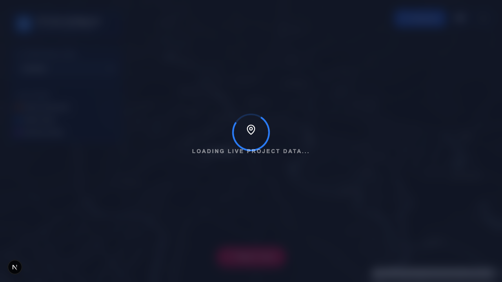
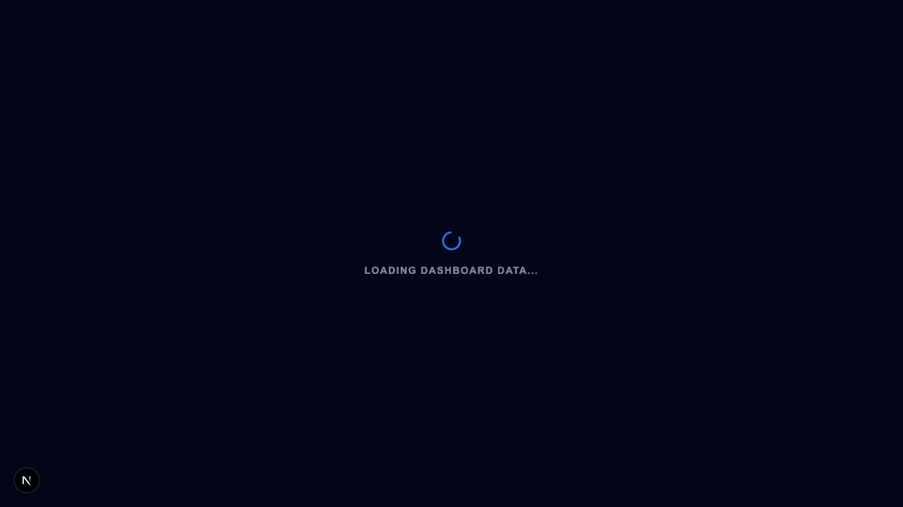
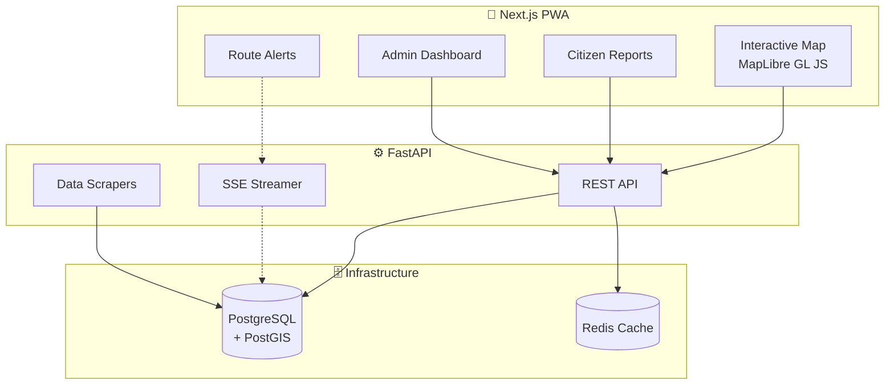

<div align="center">
  
  
  
</div>

<h1 align="center">🏙️ Infra Up — Civic Tech Platform</h1>
<p align="center"><strong>Bridging the Gap Between Citizens, Logistics, and Municipalities</strong></p>

<p align="center">
  
  
  
  
  
  
</p>

---

## 📖 Overview

**Infra Up** is a comprehensive civic technology platform designed to make urban infrastructure development fully transparent. 

Instead of citizens guessing why a road is dug up or logistics companies running into unexpected construction delays, this platform visualizes all verified government infrastructure projects (road widening, sewerage upgrades, metro line extensions) on a live, interactive map. 

---

## 📸 Application Screenshots

### Live Density Map & Citizen Reporting
*The main interactive map powered by WebGL (MapLibre), featuring spatial clustering and 3D buildings.*


### Government Analytics Dashboard
*The real-time admin dashboard tracking project delays, budget utilization, and citizen safety reports.*


---

## ✨ Core Features

- 🗺️ **Interactive Density Map**: Visualizes projects using heatmaps and cluster bubbles. Users can filter by project type (Road, Utility, Construction).
- 🔔 **Real-Time Smart Alerts**: Powered by Server-Sent Events (SSE) and PostgreSQL Triggers (`pg_notify`), users receive instant popup notifications the exact second a new project is created—no page refreshes required.
- 📋 **Permit Transparency**: See which authority (e.g., NHAI, PWD, Jal Nigam) is responsible, what the budget is, and the exact completion percentage.
- 📸 **Citizen Reporting**: Users can drop pins on the map to report safety hazards or unverified construction. These reports flow instantly into the government dashboard.
- 👨‍💼 **Analytics Dashboard**: Tracks KPIs like Total CapEx, active vs. delayed projects, and provides breakdowns by Authority.
- 🌍 **Multilingual Support**: UI toggles seamlessly between English and Hindi.

---

## 🏗️ Architecture



### The Data Flow
1. **Map Loading**: When the frontend asks for projects, FastAPI checks **Redis**. If cached, it returns instantly. If not, it runs geospatial queries on **PostGIS**, formats the data as a GeoJSON `FeatureCollection`, saves it to Redis, and sends it to the frontend.
2. **Instant Alerts**: If a scraper pushes a new infrastructure project into the database, a Postgres trigger runs natively. It alerts the FastAPI server via a socket, which broadcasts the alert to all connected browsers via SSE.

---

## 🚀 Quick Start

The entire stack is containerized for a frictionless setup.

### Prerequisites
- Docker & Docker Compose
- Node.js 20+ (for local frontend development)
- Python 3.11+ (for local backend development)

### One-Click Run (Recommended)

Start the entire platform (PostGIS, Redis, FastAPI, Next.js) using Docker:

```bash
docker compose up --build
```

- 🌐 **Frontend (UI)**: `http://localhost:3000`
- 📡 **Backend (API)**: `http://localhost:8000`
- 📖 **API Docs (Swagger)**: `http://localhost:8000/docs`

### Seeding the Database
To populate the database with realistic sample projects, run the seeder inside the backend container:

```bash
docker exec civic_backend python -m seed
```

*(Note: If you run this while the app is open, you will need to flush Redis `docker exec civic_redis redis-cli flushall` to bypass the 5-minute cache).*

---

## 🤝 Contributing

We welcome contributions to help make urban infrastructure more transparent!

1. Fork the repo
2. Create your feature branch (`git checkout -b feature/amazing-feature`)
3. Commit your changes (`git commit -m 'Add some amazing feature'`)
4. Push to the branch (`git push origin feature/amazing-feature`)
5. Open a Pull Request

## 📄 License

Distributed under the MIT License. See `LICENSE` for more information.

---

<p align="center">
  <strong>Making urban infrastructure transparent 🏙️</strong>
</p>
